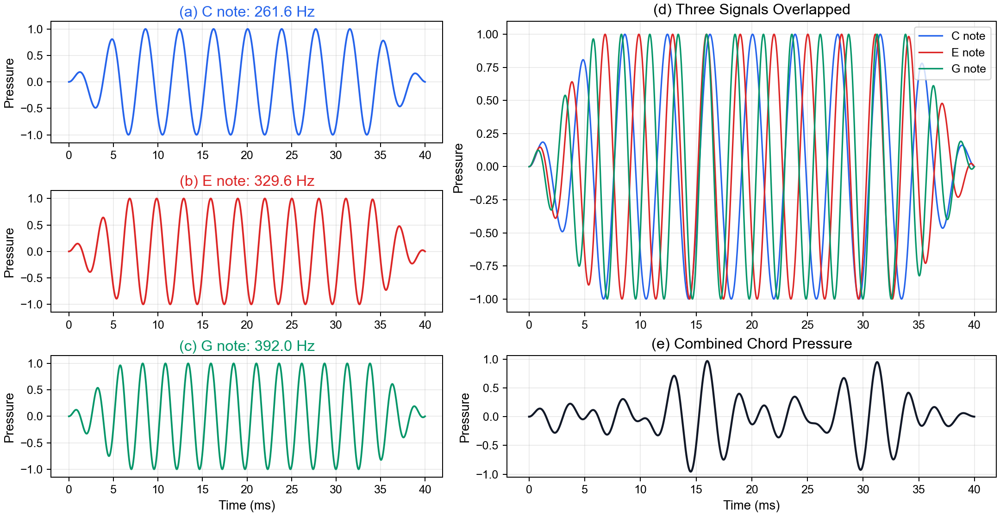
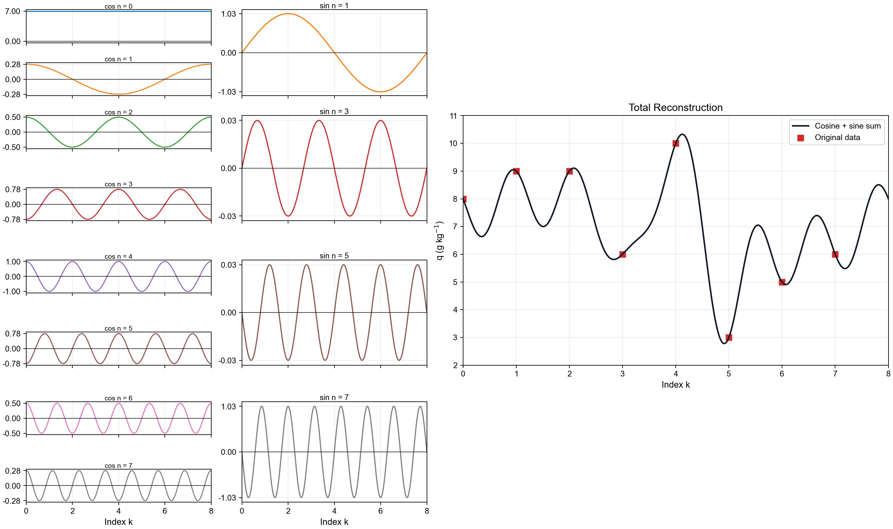

# Part 1: An introduction to Fourier transform

The **Fourier transform** (**FT**) is an integral transform that takes a function as input and outputs another function that describes the extent to which various frequencies are present in the original function. The output of the transform is a **complex valued function of frequency**. The term *Fourier transform* refers to both the mathematical operation and to this complex-valued function. When a distinction needs to be made, the output of the operation is sometimes called the frequency domain representation of the original function. The Fourier transform is analogous to decomposing the sound of a musical chord into the intensities of its constituent pitches. (from Wikipedia)


Fourier transformation 的核心思想是：把一个在时间或空间中变化的量，表示成许多不同频率或波数的波动成分之和。

在原始域中，我们看到的是信号如何随时间或空间变化；在 Fourier 域中，我们看到的是信号由哪些周期、尺度或波数构成。


## 1.1 从周期分解开始

很多复杂信号都可以看成不同周期（频率）成分的叠加。例如，一个时间序列可能同时包含：

- 快速振荡
- 慢速变化
- 平均背景值
- 随机噪声

Fourier transformation 的作用就是把这些成分分离到频率坐标上。


一段和弦(chord)的录音在时间域里，是一个复杂波形：p = x(t)

一个最简单的例子是 do-mi-sol 三和弦。3个音(C4, E4, G4)对应的频率为：

$$
f_C=261.6\ \mathrm{Hz},\quad f_E=329.6\ \mathrm{Hz},\quad f_G=392.0\ \mathrm{Hz}.
$$

在时间域中，三个音的 pressure signal 可以简单写成：

$$
p(t)=A_C\sin(2\pi f_C t)+A_E\sin(2\pi f_E t)+A_G\sin(2\pi f_G t).
$$

我们听到的是叠加后的复杂波形，而麦克风在记录声音信号时，也只能获取气压的时间序列；Fourier transform 要做的事情，是从这个复杂波形中重新识别出接近 261.6 Hz、329.6 Hz、392.0 Hz 的频率成分，如同把混合后的不同颜色的颜料进行分离。

对应示例脚本：

```bash
python scripts/1-chord.py
```



**Fig. 1.** Decomposition and recombination of a C major chord pressure signal.


该个例进行了简化，未考虑C-G信号的相位差异；以及在演奏乐器时产生的谐波（比如在钢琴上弹C4对应的键，琴弦振动后不只有261.6 Hz，还会有261.6 Hz整数倍频率的谐波），真实频谱会对应3个基频峰+每个基频的一系列谐波峰

<br>

## 1.2 常见形式

Fourier analysis 常见有三种层次：

| 对象 | 常用变换 | 典型场景 |
| --- | --- | --- |
| 连续函数 | Fourier transform | 理论推导、解析函数 |
| 离散序列 | DFT | 实测数据、采样数据 |
| 大规模离散序列 | FFT | 快速数值计算 |

DFT 是离散数据上的 Fourier transform，FFT 是快速计算 DFT 的算法。


An introduction to boundary layer meteorology 第 8.4.2 节给了一个很适合入门的 DFT 例子。给定 8 个比湿数据点：

| index | 0 | 1 | 2 | 3 | 4 | 5 | 6 | 7 |
| --- | --- | --- | --- | --- | --- | --- | --- | --- |
| Time (UTC) | 1200 | 1215 | 1230 | 1245 | 1300 | 1315 | 1330 | 1345 |
| q (g kg<sup>-1</sup>) | 8 | 9 | 9 | 6 | 10 | 3 | 5 | 6 |

这里 $N=8$， $\Delta t = 15\,\mathrm{min}$，总时长为 $P=N\Delta t=2\,\mathrm{h}$。Forward DFT 可以写作：

$$
F(n)=\frac{1}{N}\sum_{k=0}^{N-1}A(k)e^{-i\frac{2\pi nk}{N}}
$$

Using Euler's notation：

$$
F(n)=\frac{1}{N}\sum_{k=0}^{N-1}A(k)\cos\left(\frac{2\pi nk}{N}\right)
-i\frac{1}{N}\sum_{k=0}^{N-1}A(k)\sin\left(\frac{2\pi nk}{N}\right).
$$

经计算后得到的 8 个 Fourier 系数为：

| n | F(n) |
| --- | --- |
| 0 | 7.0 |
| 1 | 0.28 - 1.03i |
| 2 | 0.5 |
| 3 | -0.78 - 0.03i |
| 4 | 1.0 |
| 5 | -0.78 + 0.03i |
| 6 | 0.5 |
| 7 | 0.28 + 1.03i |

其中 $F(0)=7.0$ 是原始序列的平均值。因为原始 $A(k)$ 是实数序列，所以高频一半的系数与低频一半的系数互为 complex conjugate.


Inverse transform 可以写成：

$$
A(k)=\sum_{n=0}^{N-1}F(n)e^{i \frac{2\pi nk}{N}}
$$

对应示例脚本：

```bash
python scripts/1-stull-842.py
```



**Fig. 2.** Cosine and sine contributions in the DFT reconstruction of the Stull section 8.4.2 specific humidity example.

<br>

## 1.3 频率域能回答什么问题

Fourier spectrum 可以帮助回答：

- 哪些周期最显著？
- 一个信号的能量主要集中在哪些尺度？
- 高频噪声和低频变化如何区分？
- 两个信号是否共享相似的周期结构？

在大气科学中，这些问题对应日变化、天气尺度扰动、季节周期、湍流尺度和波动过程等。


Nieustadt: If a process would consist of a finite number of (quasi-) periodic orbits in phase space, then its spectrum would contain **discrete peaks, each associated with a periodic orbit**.

A continuous spectrum is sometimes referred to as a characteristic property of a chaotic process.
