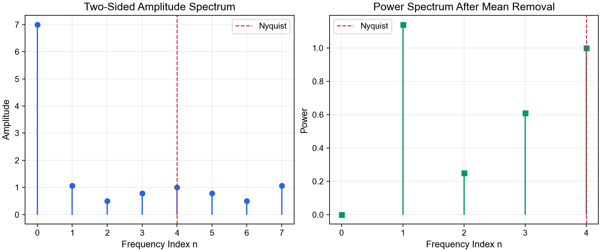

# Part 2: 离散序列的 Fourier transform

实际观测数据通常不是连续函数，而是一串离散采样点：

\[
A(0), A(1), A(2), \ldots, A(N-1).
\]

例如 Part 1 中 不同时刻的比湿序列：

\[
q=[8,9,9,6,10,3,5,6].
\]

这里 \(N=8\)，采样间隔 \(\Delta t=15\) min，总时长为2h


Part 1 已经展示了这个序列可以表示为**不同cosine, sine function的线性组合**。这一分解过程即为Discrete Fourier Transform (DFT).

由此引发一个基础的问题：

> 为什么不能只用 cosine的线性组合来表示q？为什么还需要 sine？

## 2.1 只用 cosine 能否表示这个信号？

先假设只用 cosine terms：

\[
A(k)=\sum_{n=0}^{N-1}a_n\cos\left(\frac{2\pi nk}{N}\right).
\]

看起来 \(n=0,1,\ldots,7\) 一共有 8 个 cosine terms，似乎足够表示 8 个数据点。但实际上不行。

### 2.1.1 Cosine terms 有重复

利用 cosine 的偶函数性质：

\[
\cos\left(\frac{2\pi (N-n)k}{N}\right)
=\cos\left(2\pi k-\frac{2\pi nk}{N}\right)
=\cos\left(\frac{2\pi nk}{N}\right).
\]


所以真正独立的 cosine terms 只有：

\[
n=0,1,2,3,4.
\]

也就是说，cosine-only 最多只有 5 个独立自由度，不能表示任意 8 点序列。

### 2.1.2 Cosine-only 序列是对称的

如果只用 cosine，那么构造出的序列满足：

\[
A(k)=A(N-k).
\]

这是因为：

\[
\cos\left(\frac{2\pi n(N-k)}{N}\right)
=\cos\left(2\pi n-\frac{2\pi nk}{N}\right)
=\cos\left(\frac{2\pi nk}{N}\right).
\]

但案例的 \(q\) 序列并不满足这个对称性，例如 \(q(1)=9,\ q(7)=6\)，同时 \(q(2)=9,\ q(6)=5\)。

因此，只用 cosine 不可能精确表示这个序列。

### 2.1.3 Sine terms 表示不对称部分

sine terms 满足：

\[
\sin\left(\frac{2\pi n(N-k)}{N}\right)
=-\sin\left(\frac{2\pi nk}{N}\right).
\]

所以 sine terms 可以表示相对于 \(k=0\) 的不对称部分。换句话说：

- cosine terms 描述 even part
- sine terms 描述 odd part
- cosine + sine 才能表示一般离散序列

从物理直觉看，sine 的作用也可以理解为对相位信息的补充（辅助角公式）。同一个频率的波，如果开始位置不同，只用 cosine 很难表示；加入 sine 后，就可以表示任意相位。


## 2.2 DFT

### 2.2.1 变换公式

采用 Part 1 中相同的归一化约定，forward DFT 写成：
\[
F(n)=\frac{1}{N}\sum_{k=0}^{N-1}A(k)e^{-i\frac{2\pi nk}{N}}.
\]

Using Euler's notation：

\[
F(n)=\frac{1}{N}\sum_{k=0}^{N-1}A(k)\cos\left(\frac{2\pi nk}{N}\right)
-i\frac{1}{N}\sum_{k=0}^{N-1}A(k)\sin\left(\frac{2\pi nk}{N}\right).
\]

其中：

- real part 来自 cosine projection

- imaginary part 来自 sine projection

- \(n=0\) 表示 mean value

- \(n=1\) 表示一个周期填满整个记录长度 \(P\)

- 更大的 \(n\) 表示更高频率的 harmonic

  

Inverse transform 得到原序列：

\[
A(k)=\sum_{n=0}^{N-1}F(n)e^{i \frac{2\pi nk}{N}}.
\]

上式表示利用cos, sin基元，对原始信号进行还原


### 2.2.1 DFT 默认周期延拓

DFT 处理的是有限长度序列：

\[
A(0),A(1),\ldots,A(N-1).
\]

但当我们写出 inverse transform 时：

\[
A(k)=\sum_{n=0}^{N-1}F(n)e^{i\frac{2\pi nk}{N}},
\]

右侧不仅可以在整数 \(k=0,1,\ldots,N-1\) 上计算，也可以在任意实数 \(k\in\mathbb{R}\) 上计算。因此，DFT 会把原来只有 \(N\) 个离散点的序列，延拓成一个定义在实数域上的周期函数。

这个周期函数满足：

\[
A(k+N)=A(k).
\]

也就是说，DFT 默认认为这一小段记录会不断循环重复。对于 \(q\) 例子，8 个点不是只出现一次，而是在数学上被看成：

\[
\ldots, q(0),q(1),\ldots,q(7),q(0),q(1),\ldots,q(7),\ldots
\]

因此，DFT 的结果描述的不是一个孤立片段，而是这个片段周期重复后的频率结构。采样点之间的连续曲线只是这种周期延拓下的 Fourier reconstruction，并不一定代表真实大气变量在两个观测时刻之间的实际变化。


## 2.3 理解 Fourier 系数 F(n)

### 2.3.1 共轭对

对 \(q=[8,9,9,6,10,3,5,6]\)，得到：

| \(n\) | \(F(n)\) |
| --- | --- |
| 0 | \(7.00\) |
| 1 | \(0.28-1.03i\) |
| 2 | \(0.50\) |
| 3 | \(-0.78-0.03i\) |
| 4 | \(1.00\) |
| 5 | \(-0.78+0.03i\) |
| 6 | \(0.50\) |
| 7 | \(0.28+1.03i\) |

因为 \(q(k)\) 是 real-valued sequence，所以：

\[
F(N-n)=F^*(n),
\]

其中 \(^*\) 表示 complex conjugate。因此 \(n=5,6,7\) 并不是新的独立频率，而是 \(n=3,2,1\) 的共轭对应项。


### 2.3.2 Nyquist frequency

离散采样有一个基本限制：至少需要两个采样点才能解析一个周期。

因此最高可解析频率是 Nyquist frequency：

\[
n_f=\frac{N}{2}.
\]

The highest frequency that can be resolved in our Fourier analysis is \(n_f\) 

As for \(N=8\), \(n_f=4\)

e.g. The n = 6 signal was folded into the n=2 frequency.

Any nonzero wave amplitudes and spectral energies in the "true" signal **at frequencies higher than the Nyquist frequency are folded back and added** to the energies of the "true" signal at the lower frequencies, yielding an aliased (and erroneous) spectrum.


## 2.4 从 Fourier 系数到 spectrum

Fourier 系数 \(F(n)\) 是复数。\(F(n)\) 同时包含：

- amplitude information
- phase information

如果我们只想知道“哪个频率的振幅更大”，就需要把 complex coefficient 转换成 spectrum。

常见定义包括 amplitude spectrum，即 \(|F(n)|=\sqrt{F_{\mathrm{real}}^2(n)+F_{\mathrm{imag}}^2(n)}\)，以及 power spectrum，即 \(S(n)=|F(n)|^2\)。注意这里\(F_{\mathrm{imag}}(n)\) 取的是虚部，虚部是一个实数 (3 + 2i的虚部为2，而不是2i)

针对我们之前对比湿 \(q\) 进行 DFT 得到的 \(F(n)\)，我们可以计算各个频率下的振幅：

| \(n\) | Amplitude | Power |
| --- | --- | --- |
| 0 | 7.00 | 49.00 |
| 1 | 1.07 | 1.14 |
| 2 | 0.50 | 0.25 |
| 3 | 0.78 | 0.61 |
| 4 | 1.00 | 1.00 |
| 5 | 0.78 | 0.61 |
| 6 | 0.50 | 0.25 |
| 7 | 1.07 | 1.14 |

这个表说明：**spectrum 不再关心每个频率的相位，而是关心每个频率成分的强弱**。

对于 real-valued sequence，spectrum 也是对称的，即 \(S(N-n)=S(n)\)。

因此通常只看 \(0\le n\le N/2\) 的 single-sided spectrum。

需要注意，\(n=0\) 是平均值。如果直接画 power spectrum，mean 通常会占据很大的能量，使其它频率成分不容易看清。因此实际分析中常先去除平均值，再画 \(n>0\) 的 spectrum。

对应示例脚本：

```bash
python scripts/2-spectrum.py
```



**Fig. 3.** Amplitude spectrum and mean-removed power spectrum of the Stull specific-humidity sequence.


## 2.5 理解 DFT 的本质

前面的 \(q\) 例子已经说明：一个离散序列可以通过 cosine 和 sine 的线性组合表示；Fourier coefficient 可以进一步转化为 spectrum；通过分析 spectrum，我们可以获悉不同频率成分的强度，以及它们对方差或能量的贡献。

我们换一个角度，借助线性代数中的基向量（基底）来理解 DFT 。

### 2.5.1 平面直角坐标系与基向量

在二维直角坐标系中，我们常用单位向量 \(\mathbf{i}\)、\(\mathbf{j}\) 作为基向量。任意二维向量都可以写成：

\[
\mathbf{x}=x_1\mathbf{i}+x_2\mathbf{j}.
\]

其中 \(x_1\)、\(x_2\) 是 \(\mathbf{x}\) 在两个正交方向上的投影。由于：

\[
\mathbf{i}\cdot\mathbf{j}=0,
\]

两个方向互不干扰，所以投影可以通过 dot product 得到。

公式(19)就对应**基底的正交性**：
$$
\langle u,v\rangle=\sum_{k=0}^{N-1}u(k)v(k) =0
$$

二维坐标系里就对应 \(\mathbf{i}\cdot\mathbf{j}=0\)。正交性保证了不同频率方向上的投影不会互相污染。


例如坐标系中的点 \((4,3)\) 对应向量 \(r=4\mathbf{i}+3\mathbf{j}\)


因为 \(\mathbf{i}\) 和 \(\mathbf{j}\) 都是单位向量：\( \mathbf{r} \cdot \mathbf{i}=4,\qquad \mathbf{r}\cdot\mathbf{j}=3 \)

点乘可以告诉我们：原向量在某个基向量方向上有多少分量。


### 2.5.2 Cosine 和 sine 构成频率空间的基底

DFT 做的是类似的事情，只是空间从二维变成了 \(N\) 维。一个长度为 \(N\) 的离散序列可以看成一个 \(N\)-dimensional vector：

\[
\mathbf{A}=(A(0),A(1),\ldots,A(N-1)).
\]

为了表示这个向量，我们不再使用 \(\mathbf{i}\)、\(\mathbf{j}\)，而是选择一组由不同频率的 cosine 和 sine 构成的基底：

\[
\cos\left(\frac{2\pi nk}{N}\right),\qquad
\sin\left(\frac{2\pi nk}{N}\right).
\]

这里 \(k=0,1,\ldots,N-1\)。

我们把基底按序排列可以构成2个基底序列：
\[
\mathbf{c}_n=
\left[
\cos\left(\frac{2\pi n\cdot0}{N}\right),
\cos\left(\frac{2\pi n\cdot1}{N}\right),
\ldots,
\cos\left(\frac{2\pi n(N-1)}{N}\right)
\right].
\]

\[
\mathbf{s}_n=
\left[
\sin\left(\frac{2\pi n\cdot0}{N}\right),
\sin\left(\frac{2\pi n\cdot1}{N}\right),
\ldots,
\sin\left(\frac{2\pi n(N-1)}{N}\right)
\right].
\]


有了基底以后，下一步就是问：原始信号 \(A(k)\) 在某个基底方向上有多少分量？

在线性代数中，这件事通过 **dot product** 完成；在离散信号中，对应的是“逐点相乘再求和”：

\[
\langle A,g\rangle=\sum_{k=0}^{N-1}A(k)g(k).
\]

不同频率的基元应具有正交性。用 discrete inner product 表示，

以 \(N=8\) 为例，取两个不同频率的 cosine basis：
\[
c_1(k)=\cos\left(\frac{2\pi k}{8}\right),
\qquad
c_2(k)=\cos\left(\frac{4\pi k}{8}\right).
\]

它们的离散内积为：

\[
\langle c_1,c_2\rangle
=\sum_{k=0}^{7}
\cos\left(\frac{2\pi k}{8}\right)
\cos\left(\frac{4\pi k}{8}\right)
=0.
\]

同样，对于 sine basis，例如：

\[
s_1(k)=\sin\left(\frac{2\pi k}{8}\right),
\qquad
s_3(k)=\sin\left(\frac{6\pi k}{8}\right),
\]

也有：

\[
\langle s_1,s_3\rangle
=\sum_{k=0}^{7}
\sin\left(\frac{2\pi k}{8}\right)
\sin\left(\frac{6\pi k}{8}\right)
=0.
\]

cosine basis 和 sine basis 之间也正交，例如：

\[
\langle c_1,s_1\rangle
=\sum_{k=0}^{7}
\cos\left(\frac{2\pi k}{8}\right)
\sin\left(\frac{2\pi k}{8}\right)
=0.
\]

这些离散正交关系说明：不同频率、不同相位类型的基底具有互相独立的方向。如果原始信号在某个频率的基底上有很强的投影，这个投影不会被错误地算到另一个频率上。正是这种性质，使我们可以把一个复杂离散序列拆成不同频率上的独立贡献。


如果采样点越来越密，离散求和会变成积分（卷积）：

\[
\langle f,g\rangle=\int_0^T f(x)g(x)\,dx.
\]

所以 Fourier transform 中的积分，本质上也是一种投影：把 \(f(x)\) 投影到某个 sine/cosine wave 上，得到该频率在原函数中的分量。

对于周期为 \(2\pi\) 的连续函数，不同频率的 sine/cosine 也满足正交性。对于 \(m\neq n\)：

\[
\begin{aligned}
\langle \cos(mx),\cos(nx)\rangle
&=\int_0^{2\pi}\cos(mx)\cos(nx)\,dx \\
&=\frac{1}{2}\int_0^{2\pi}
\left[\cos((m-n)x)+\cos((m+n)x)\right]\,dx \\
&=0.
\end{aligned}
\]

\[
\begin{aligned}
\langle \sin(mx),\sin(nx)\rangle
&=\int_0^{2\pi}\sin(mx)\sin(nx)\,dx \\
&=\frac{1}{2}\int_0^{2\pi}
\left[\cos((m-n)x)-\cos((m+n)x)\right]\,dx \\
&=0.
\end{aligned}
\]

cosine basis 和 sine basis 之间也彼此正交：

\[
\begin{aligned}
\langle \cos(mx),\sin(nx)\rangle
&=\int_0^{2\pi}\cos(mx)\sin(nx)\,dx \\
&=\frac{1}{2}\int_0^{2\pi}
\left[\sin((n+m)x)+\sin((n-m)x)\right]\,dx \\
&=0.
\end{aligned}
\]

这也就是 correlation / convolution 思想进入 Fourier analysis 的地方。内积 \(\int_0^T f(x)g(x)\,dx\) 可以理解为用一个模板 \(g(x)\) 去匹配信号 \(f(x)\)；如果让模板发生平移，再计算每个平移位置上的匹配程度，就得到 correlation 或 convolution。Fourier analysis 选择的模板不是任意函数，而是一系列不同频率的 sine/cosine waves。


### 2.5.3 Fourier coefficient 是投影

现在再看 forward DFT：

\[
F(n)=\frac{1}{N}\sum_{k=0}^{N-1}A(k)e^{-i\frac{2\pi nk}{N}}.
\]

这个式子的本质是 inner product：把原始序列 \(A(k)\) 和某个频率为 \(n\) 的 complex basis 做点乘，得到原序列在这个 frequency direction 上的投影。

如果利用Euler公式展开上式：

\[
F(n)=\frac{1}{N}\sum_{k=0}^{N-1}A(k)\cos\left(\frac{2\pi nk}{N}\right)
-i\frac{1}{N}\sum_{k=0}^{N-1}A(k)\sin\left(\frac{2\pi nk}{N}\right).
\]

可以看到：

- real part 是 \(A(k)\) 在 cosine basis 上的投影
- imaginary part 是 \(A(k)\) 在 sine basis 上的投影

也就是说，DFT 做的事情就是把投影模板 \(g(k)\) 换成一系列 frequency templates：

\[
g_n(k)=e^{-i\frac{2\pi nk}{N}}.
\]

于是：

\[
F(n)=\frac{1}{N}\sum_{k=0}^{N-1}A(k)g_n(k).
\]

因此，\(F(n)\) 衡量的是原始序列 \(A(k)\) 与频率为 \(n\) 的 sine/cosine wave 有多相似。DFT 使用一整组正交的 sine/cosine templates，所以得到的是一组互相独立的频率投影。


### 2.5.4 为什么选择 cosine 和 sine构造基底

cosine 和 sine 作为基本的周期函数，具有一系列很好的数学和物理性质。

* 它们是简谐运动的自然解。

  对于最简单的钟摆运动：

\[
\frac{d^2x}{dt^2}=-kx,
\]

其解可以写成 sine/cosine 的形式。这说明 sine/cosine 天然对应周期振动。

* 它们求导、积分后仍然保持在 sine/cosine 家族中。

\[
\frac{d}{dt}\sin(\omega t)=\omega\cos(\omega t),
\]

\[
\frac{d}{dt}\cos(\omega t)=-\omega\sin(\omega t).
\]

这种性质使它们在微分方程、波动问题和大气动力学中非常便捷。

* 不同频率的 sine/cosine 在完整周期上正交。

正交性让我们可以像在直角坐标系中分解向量一样，把复杂信号分解到不同频率方向上。例如 \(c_1(k)\) 与 \(c_2(k)\) 的点乘为 0，说明这两个 frequency directions 互不重叠；把信号投影到 \(c_1\) 上时，不会混入 \(c_2\) 的贡献。


因此，DFT 的核心思路可以概括为：

> 把离散序列看成 \(N\) 维向量，再用一组正交的 sine/cosine 基底表示它；Fourier transform 给出的是这个向量在各个频率基底上的投影坐标。
