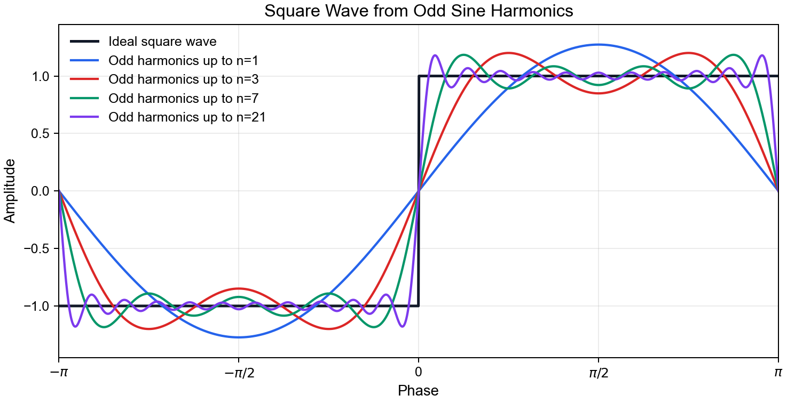
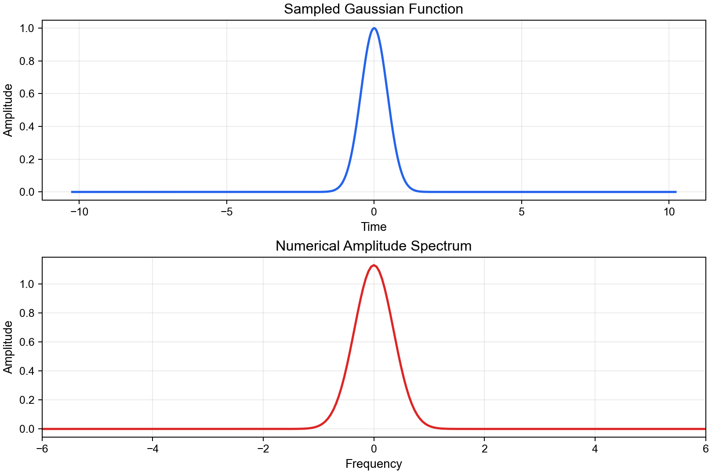

# Part 3: 连续函数的 Fourier transform 以及 spectrum

Part 2 讨论的是有限长度离散序列。实际问题中，我们也经常先从连续函数出发：

\[
f(t),\qquad -\infty<t<\infty.
\]

连续函数的 Fourier transform 仍然是在回答同一个问题：

> 一个随时间或空间变化的函数，可以分解成哪些 frequency components？

只不过这时 frequency 不再只是 \(n=0,1,\ldots,N-1\) 这些离散的index，而可以是连续变量。


## 3.1 从 Fourier series 到 Fourier transform

如果函数是周期函数，最自然的表示方式是 Fourier series。也就是说，一个周期函数可以写成许多 sine/cosine harmonics 的线性组合。

一个很经典的例子是 50% duty cycle、关于原点奇对称的 square wave。把它定义在 \([-\pi,\pi]\) 上，并延拓到实数域 \(\mathbb{R}\)：

\[
x(t)=
\begin{cases}
-1, & -\pi<t<0,\\
1, & 0<t<\pi,
\end{cases}
\qquad x(t+2\pi)=x(t).
\]

这个方波可以展开为：

\[
x(t)=\frac{4}{\pi}\left[
\sin t
+\frac{1}{3}\sin 3t
+\frac{1}{5}\sin 5t
+\cdots
\right].
\]

这里有几个重要信息：

- 只有 odd harmonics：\(1,3,5,\ldots\)
- 每个 harmonic 的 amplitude 按 \(1/n\) 递减
- 这个写法只用了 sine，是因为这个 square wave 关于原点对称，是奇函数

如果我们把同一个 square wave 平移相位，或者把它定义成 even symmetry，那么展开式中就会出现 cosine terms，或者 sine/cosine 同时出现。因此具体用 sine 还是 cosine，不是由“方波”本身唯一决定的，而是由相位和对称性决定的。

对应示例脚本：

```bash
python scripts/3-square-wave.py
```



**Fig. 4.** Reconstruction of an odd square wave using increasing numbers of odd sine harmonics.


**为什么需要无穷多个高频？**

因为方波有非常陡的跳变。低频只能描述缓慢变化，要拼出“突然从 -1 跳到 +1”的尖锐边缘，就必须加入越来越高的频率。


## 3.2 Fourier transform

Fourier series 适合周期函数。对于非周期函数，我们不再把信号看成一组离散 harmonics 的和，而是看成连续频率上的积分叠加。

采用角速度 \(\omega\) 时，continuous Fourier transform 可以写成：

\[
F(\omega)=\int_{-\infty}^{\infty} f(t)e^{-i\omega t}\,dt.
\]

inverse transform 写成：

\[
f(t)=\frac{1}{2\pi}\int_{-\infty}^{\infty} F(\omega)e^{i\omega t}\,d\omega.
\]

这里 \(F(\omega)\) 仍然是一个 complex-valued function。它包含两类信息：

- amplitude：该 frequency component 有多强
- phase：该 frequency component 在时间上如何平移

如果使用普通频率 \(f\)，则：

\[
\omega=2\pi f.
\]

所以看到文献中使用 \(f\)、\(\nu\)、\(\omega\) 时，需要先确认它用的是 frequency 还是 angular frequency。


## 3.3 Continuous spectrum

Fourier transform 的结果 \(F(\omega)\) 本身还不是我们通常画出来的 spectrum。常见谱量包括：

- amplitude spectrum: \(|F(\omega)|\)
- power spectrum: \(|F(\omega)|^2\)
- power spectral density: 单位频率范围内的 power 或 variance contribution

如果一个 signal 由几个纯周期波组成，它的 spectrum 会出现离散 peaks。比如 Part 3 的 square wave 是周期信号，所以它的能量集中在 odd harmonics 上。

但对湍流或大气变量而言，信号往往不是几个完美周期的叠加，而是许多尺度共同作用的结果。这时 spectrum 往往更接近连续分布。低频通常对应 long time scale 或 large-scale structure；高频通常对应 short time scale 或 small-scale structure。


## 3.4 Correlation function

Nieuwstadt et al. (2015) Chapter 9 提供了一个很适合大气湍流的角度：从 time correlation function 出发理解 spectrum。

设 \(u'(t)\) 是某个 turbulent fluctuation，且平均值为 0。考虑两个时刻 \(t_1\)、\(t_2\) 上的值：

\[
\overline{u'(t_1)u'(t_2)}.
\]

如果过程是 stationary 的，那么这个 correlation 不依赖于 \(t_1\)、\(t_2\) 的绝对位置，只依赖于时间差：

\[
\tau=t_1-t_2.
\]

因此可以写成：

\[
\overline{u'(t_1)u'(t_2)}
=R(t_1-t_2)
=R(\tau).
\]

这就是 autocorrelation function。它告诉我们：相隔 \(\tau\) 的两个 fluctuation 之间还有多相似。

- 当 \(\tau=0\) 时，\(R(0)=\overline{u'^2}\)，即 variance
- 当 \(\tau\) 很大时，\(R(\tau)\) 通常趋近于 0，说明相隔很久的 fluctuation 不再相关
- \(R(\tau)\) 衰减得越慢，说明 signal 中越有 long time scale structure


对于 stationary process，autocorrelation function 和 spectrum 可以构成一对 Fourier transform pair：

\[
S(\omega)=\frac{1}{2\pi}
\int_{-\infty}^{\infty}
R(\tau)e^{-i\omega\tau}\,d\tau.
\]

\[
R(\tau)=
\int_{-\infty}^{\infty}
S(\omega)e^{i\omega\tau}\,d\omega.
\]

这组公式的含义：

> spectrum 不是凭空出现的，它可以看成 correlation function 在 frequency domain 中的表达。

如果令 \(\tau=0\)，就得到：

\[
R(0)=\overline{u'^2}
=\int_{-\infty}^{\infty}S(\omega)\,d\omega.
\]

也就是说，spectrum 对所有频率积分后，给出 fluctuation 的总 variance。对于速度 fluctuation，这个 variance 可以和 turbulent kinetic energy 联系起来；因此 spectrum 常被解释为 energy 或 variance 在不同频率上的分布。

由于 \(R(\tau)\) 对 stationary real-valued signal 通常是 even function，实际中也常写成 cosine transform 的形式：

\[
E(\omega)=\frac{2}{\pi}
\int_0^\infty R(\tau)\cos(\omega\tau)\,d\tau.
\]

\[
R(\tau)=\int_0^\infty E(\omega)\cos(\omega\tau)\,d\omega.
\]

这里 \(E(\omega)\) 可以理解为 one-sided spectrum。


我们将在Part5利用观测数据，实现对\(\overline{u^{\prime 2}}\) 能谱的分析


## 3.6 数值计算：连续理论到离散实现

计算机不能直接处理无限长连续函数，所以实际计算时仍然要回到离散近似：

1. 选择有限时间窗口
2. 用固定采样间隔 \(\Delta t\) 采样
3. 用 DFT/FFT 近似 continuous Fourier transform
4. 根据采样率和窗口长度解释 spectrum

这会带来几个限制：

- 有限窗口会导致 spectral leakage
- 有限采样率会限制最高可解析频率
- 离散频率间隔由总记录长度决定
- 是否去均值会显著影响低频和 \(n=0\) 成分


## 3.7 求解连续函数FT典型例子：Gaussian

Gaussian 函数的 Fourier transform 仍然是 Gaussian。这使它成为检验连续 FT 数值近似的好例子。

运行示例：

```bash
python scripts/3_continuous_spectrum.py
```



**Fig. 5.** Numerical Fourier transform of a sampled Gaussian function.


