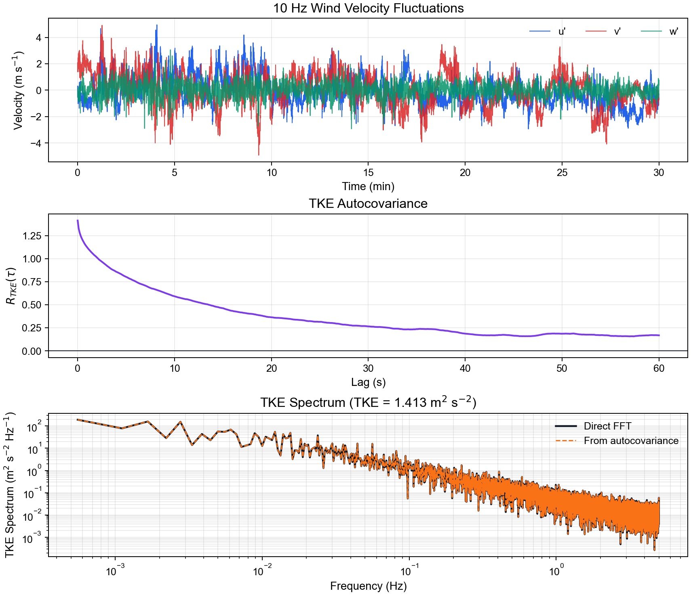

# Part 5: TKE spectrum from 10 Hz eddy-covariance data

本案例使用 10 Hz eddy-covariance wind data 计算 turbulent kinetic energy (TKE) spectrum。数据来自本地目录：

```text
/Users/lanbo/code/turbulence/10Hz/FI-Sii_EC_20180706_L09_F02/data
```

示例脚本默认读取其中一个 30 min 文件：

```text
FI-Sii_EC_201807061200_L09_F01.csv
```

CSV 文件中包含三维风速分量：

\[
U(t),\quad V(t),\quad W(t).
\]


## 5.1 Velocity fluctuations and TKE

首先去除每个速度分量的平均值：

\[
u'=U-\overline{U},\qquad
v'=V-\overline{V},\qquad
w'=W-\overline{W}.
\]

TKE 定义为：

\[
TKE=\frac{1}{2}
\left(
\overline{u'^2}
+\overline{v'^2}
+\overline{w'^2}
\right).
\]

如果要计算 TKE spectrum，不是先构造一个单独的 TKE time series 再做 FFT，而是分别计算 \(u'\)、\(v'\)、\(w'\) 的 spectra，然后合成：

\[
E_{TKE}(f)=\frac{1}{2}
\left[
S_u(f)+S_v(f)+S_w(f)
\right].
\]

这里 \(S_u(f)\)、\(S_v(f)\)、\(S_w(f)\) 是三个速度分量的 one-sided power spectral density。


## 5.2 What is the spectrum of \(R(\tau)\)?

Part 3 已经说明，correlation function 和 spectrum 是 Fourier transform pair。对一个 velocity component 来说：

\[
R_u(\tau)=\overline{u'(t)u'(t+\tau)}.
\]

它的 spectrum 就是 \(R_u(\tau)\) 的 Fourier transform：

\[
S_u(f)=
\int_{-\infty}^{\infty}
R_u(\tau)e^{-i2\pi f\tau}\,d\tau.
\]

对于 real-valued stationary signal，\(R_u(\tau)\) 是 even function，因此也可以写成 cosine transform：

\[
S_u(f)=
2\int_0^\infty
R_u(\tau)\cos(2\pi f\tau)\,d\tau.
\]

这就是 Wiener-Khinchin theorem 的核心：**power spectrum is the Fourier transform of the autocovariance function**。

对 TKE 来说，可以先定义 TKE autocovariance：

\[
R_{TKE}(\tau)=
\frac{1}{2}
\left[
R_u(\tau)+R_v(\tau)+R_w(\tau)
\right].
\]

那么 TKE spectrum 也可以写成：

\[
E_{TKE}(f)=
\int_{-\infty}^{\infty}
R_{TKE}(\tau)e^{-i2\pi f\tau}\,d\tau.
\]

这和直接由 \(u'\)、\(v'\)、\(w'\) 做 FFT 得到的 TKE spectrum 是同一件事的两种表达。


## 5.3 Direct FFT method

实际计算时，最简单的方法是直接对速度脉动做 FFT：

```python
u_prime = u - np.mean(u)
U_hat = np.fft.rfft(u_prime)
freq = np.fft.rfftfreq(len(u_prime), d=1 / sample_rate)
```

然后计算 one-sided PSD。若采样频率为 \(f_s\)，序列长度为 \(N\)，一种常用归一化为：

\[
S_u(f)=\frac{|\hat{u}(f)|^2}{f_s N}.
\]

内部频率需要乘以 2，以合并负频率贡献。最后：

\[
E_{TKE}(f)=\frac{1}{2}
\left[
S_u(f)+S_v(f)+S_w(f)
\right].
\]

该谱满足：

\[
\int_0^{f_N}E_{TKE}(f)\,df
\approx TKE.
\]


## 5.4 Autocovariance method

为了展示 \(R(\tau)\) 和 spectrum 的关系，脚本也计算：

\[
R_{TKE}(\tau)=
\frac{1}{2}
\left[
R_u(\tau)+R_v(\tau)+R_w(\tau)
\right].
\]

然后再从 \(R_{TKE}(\tau)\) 得到 spectrum。图中会同时画出：

- Direct FFT spectrum
- Spectrum from autocovariance

两条曲线应基本重合。这个结果说明：直接 FFT 和先算 \(R(\tau)\) 再做 Fourier transform，在理论上是等价的。


## 5.5 Run the example

```bash
conda run -n meteoro python scripts/5_atmospheric_case.py
```

Output:

```text
docs/figures/part05_atmospheric_case.png
```



**Fig. 6.** Wind velocity fluctuations, TKE autocovariance, and TKE spectrum computed directly from FFT and from autocovariance.


## 5.6 Notes

This example is intentionally simple. It does not yet include:

- coordinate rotation
- despiking
- stationarity checks
- block averaging
- inertial-subrange fitting
- conversion from frequency spectrum to wavenumber spectrum using Taylor's frozen-turbulence hypothesis

These steps can be added later when the goal shifts from Fourier-transform teaching to full turbulence-data processing.
